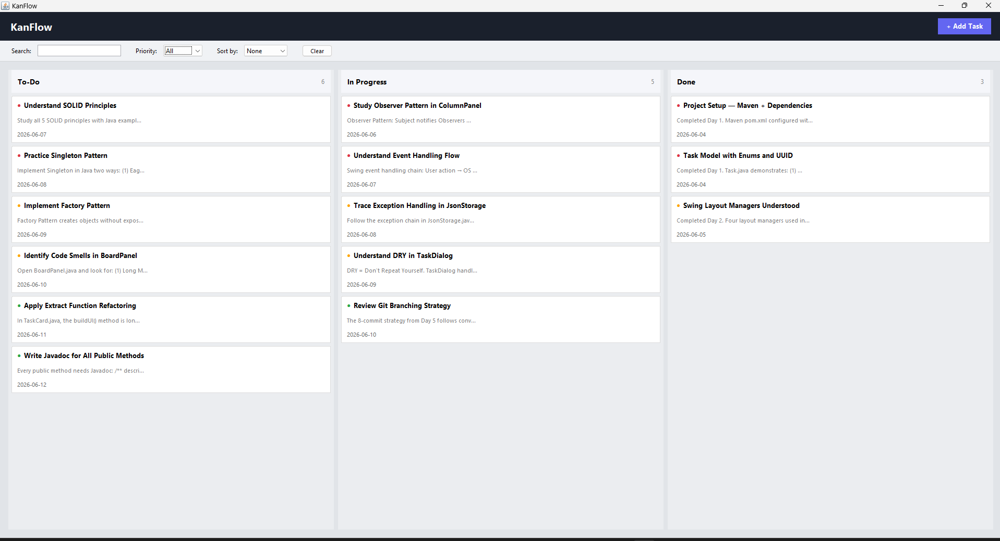
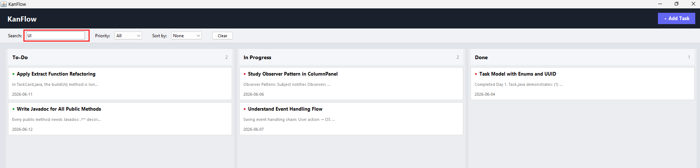
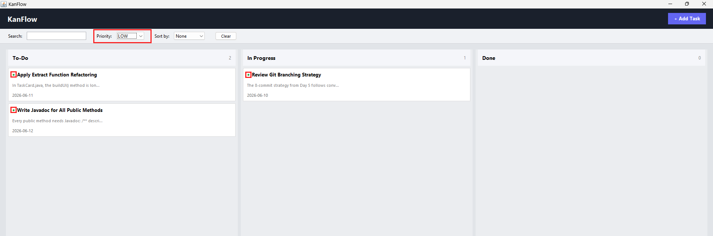
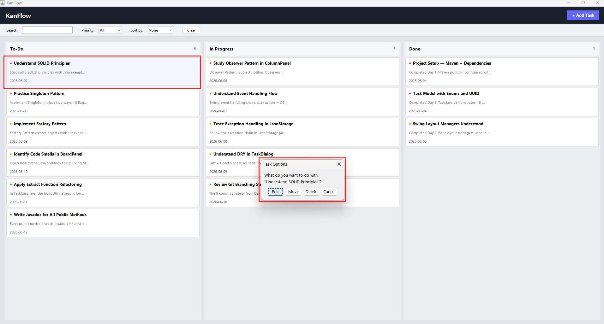
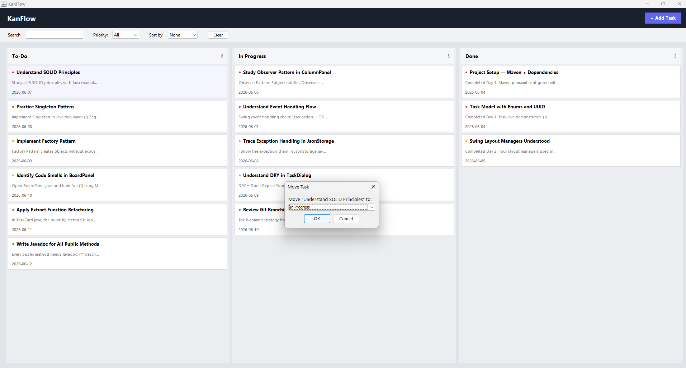
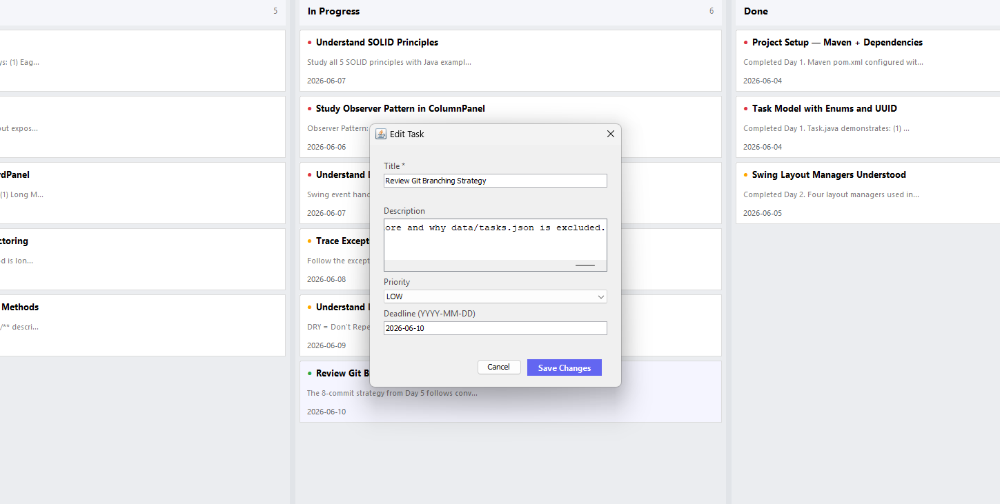
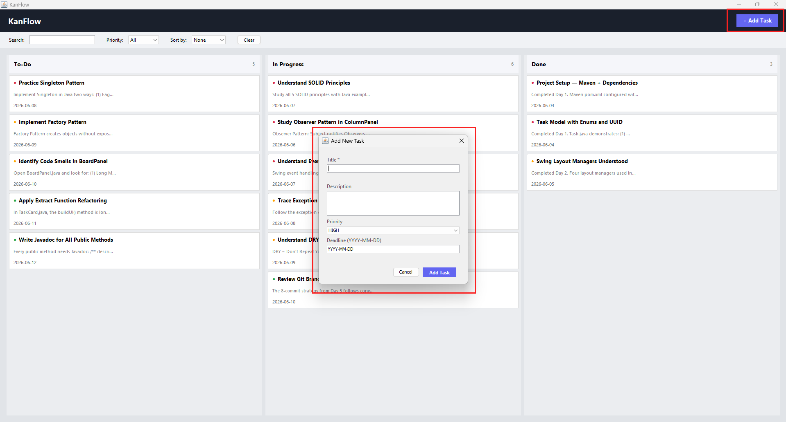
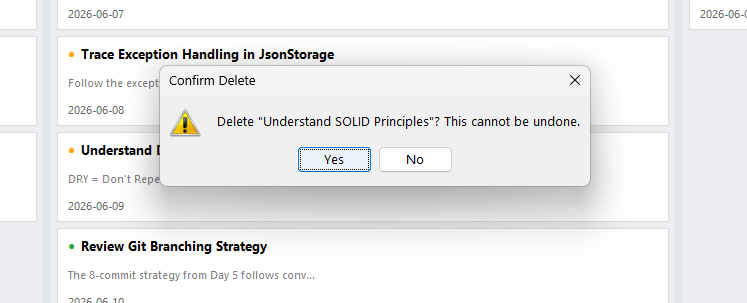
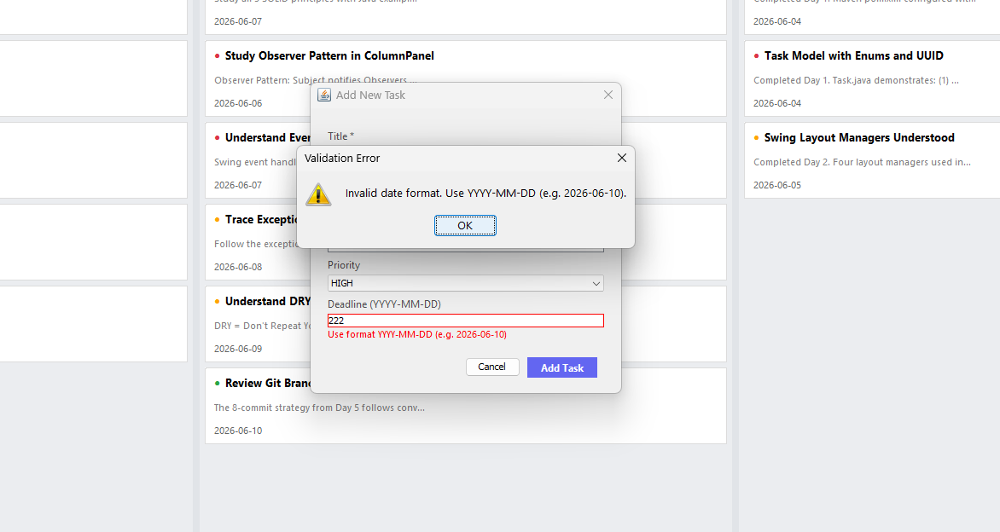

# KanFlow — Desktop Kanban Task Manager

A Java Swing desktop application for managing tasks across a 3-column
Kanban board (To-Do → In Progress → Done).

Built as a semester project for the Software Construction & Design (SCD)
course at the University of Central Punjab.

---

## Features

- Add, edit, move, and delete tasks
- Priority levels: HIGH / MEDIUM / LOW with color indicators
- Deadline tracking with overdue highlighting
- Filter by priority, search by title/description
- Sort by deadline or priority
- Persistent JSON storage (survives app restart)
- SLF4J logging throughout
- Full JUnit 5 test suite

---

## Tech Stack

| Layer       | Technology           |
|-------------|----------------------|
| Language    | Java                 |
| GUI         | Java Swing / AWT     |
| Persistence | Gson 2.10 (JSON)     |
| Logging     | SLF4J 2.0            |
| Testing     | JUnit 5.10           |
| Build       | Maven                |
| Version Control | Git + GitHub        |

---

## Design Principles Applied

- **SOLID :** Single responsibility per class (Task, JsonStorage, BoardPanel each do one thing)
- **DRY :** TaskDialog handles both Add and Edit modes
- **Refactoring :** Extract Class (ColumnPanel), Extract Function (validateTitle), Encapsulate Variable (Task fields private with getters/setters)
- **Design Patterns :** Observer (CardClickListener interface), Strategy (SortOption enum drives sort behavior)

---


## How to Run

1. Clone the repo
2. Open in IntelliJ IDEA
3. Let Maven download dependencies
4. Run `Main.java`

---

## How to Test

```bash
mvn test
```

---

## Author
**Areef ur Rahman**  
BS Software Engineering, University of Central Punjab












